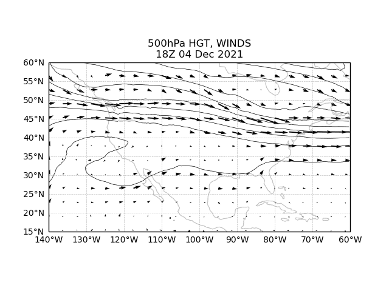
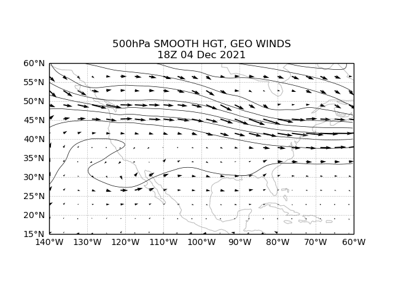
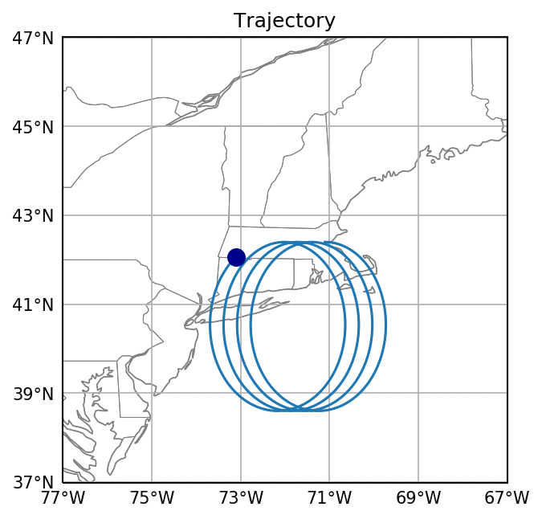

# python

python code I've made for courses in atmospheric dynamics

<b> python how-to </b>
 
for info on how to install python and get going, as well as tutorials and examples:
https://unidata.github.io/python-training/python/intro-to-python/

<b> gfs_geostrophic_1.0.py </b>
 
This program gets real-time GFS data from the UCAR server and calculates and plots geostrophic winds.  Requires numpy, matplotlib, cartopy, and xarray. You can do all this with built-in functions through the MetPy package, but this is intended to be a more basic example.

  
   

<b> inertial_oscillations_1.1.py </b>
 
This program calculates and plots inertial oscillation trajectories.

 

<b> Acknowledgements </b>
 
Support from NSF AGS-1623912 and AGS-1657921 is gratefully acknowledged

